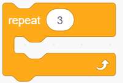
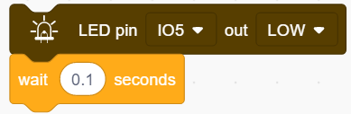
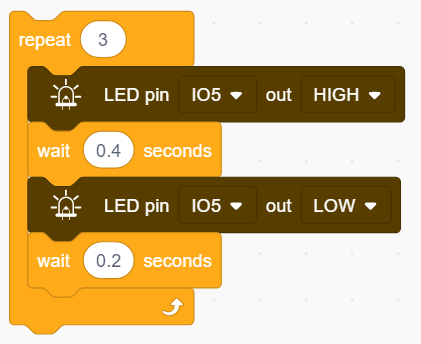
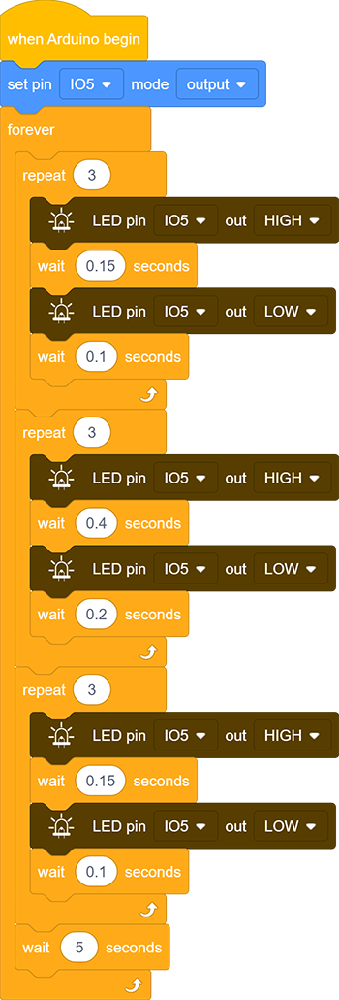

### Progetto 3 Dispositivo di Soccorso SOS

**1. Descrizione**

Il dispositivo SOS è in grado di emettere segnali di soccorso, che coincidono con il principio del codice Morse. È comodo per le emergenze.

**2. Schema di Collegamento**

**3. Codice di Test**

Prima di tutto, dobbiamo chiarire come lampeggia la luce di soccorso SOS: il LED lampeggia rapidamente 3 volte per la lettera “S” e lentamente 3 volte per la lettera “O”.

Successivamente, controlliamo il numero di lampeggi e la durata tramite l'istruzione "for" e impostiamo l'intervallo di tempo tra le lettere.

1. Trascina i due blocchi di codice.

2. Trascina il blocco seguente nella sezione "Pins" e imposta il pin IO5 come output.

**Lettera "S"**

3. Trascina il blocco seguente dalla sezione "Control" e impostalo a 3 volte, poiché "S" significa lampeggiare 3 volte.

4. Trascina i blocchi seguenti dalla sezione "LED" e imposta il pin IO5 su HIGH. Poi imposta il tempo di ritardo a 0.15s.

5. Trascina i blocchi seguenti dalla sezione "LED" e imposta il pin IO5 su LOW. Poi imposta il tempo di ritardo a 0.1s.

**Lettera O**

6. Riferisciti ai passaggi precedenti per costruire i blocchi di codice seguenti. Modifica l'uscita HIGH con un ritardo di 0.4s e LOW con un ritardo di 0.2s.

**Lettera S**

7. Ripeti i passaggi 3, 4 e 5.

8. Aggiungi un ritardo di 5s alla fine, e "SOS" si ripeterà ogni 5s.

   

**Codice Completo：**

**4. Risultato del Test**

Dopo aver caricato il codice, il LED lampeggia rispettivamente 3 volte rapidamente e lentamente.