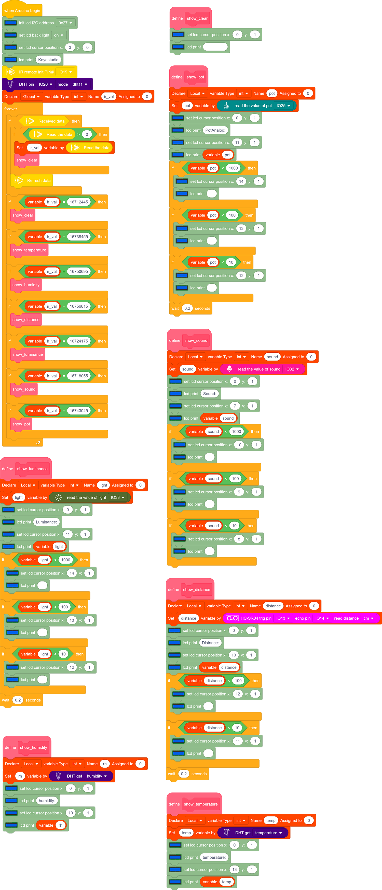

### Progetto 30 Casa Intelligente

**1. Descrizione**

In questa era tecnologica, siamo tutti familiari con la casa intelligente. È un sistema che può controllare gli elettrodomestici tramite pulsanti.

In questo progetto, vogliamo simulare una casa intelligente tramite un telecomando IR. Con Arduino MCU come nucleo, può essere utilizzato per controllare luci, condizionatori, TV e monitor di sicurezza.

**2. Diagramma di Flusso**

**3. Schema di Collegamento**

**4. Codice di Test**

Con il telecomando IR, questa casa intelligente mostra vari valori dei sensori su LCD, inclusi un sensore di temperatura e umidità, un sensore di suono, un fotoresistore, un potenziometro e un sensore ad ultrasuoni.

**5. Risultato del Test**

Dopo aver collegato i cavi e caricato il codice, possiamo vedere i contenuti corrispondenti sul LCD premendo i pulsanti. Il pulsante OK cancella la visualizzazione dei sensori.

**6. Spiegazione del Codice**

I blocchi sono così numerosi che adottiamo la funzione "Make a Block". Facendo ciò, numerosi blocchi vengono raggruppati e possono essere richiamati direttamente, semplificando notevolmente l’intero programma.

Clicca su “My Block” per creare un blocco definito dall’utente, e potrai costruire i tuoi blocchi di codice.

