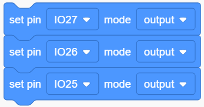
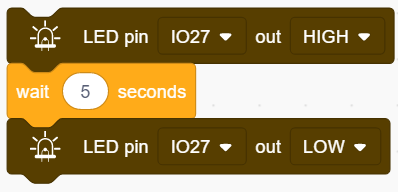

### Proyecto 4 Semáforo

**1. Descripción**

El módulo de semáforo es un dispositivo utilizado para controlar el paso de peatones y vehículos. Incluye una luz roja, una amarilla y una verde, que implican diferentes instrucciones.

**Rojo para Detenerse:** Peatones y vehículos deben detenerse.

**Amarillo para Precaución:** Peatones y vehículos deben prepararse para detenerse. Si la conducción ya está en proceso, la velocidad debe ser lenta.

**Verde para Avanzar:** Peatones y vehículos continúan respetando las normas de tráfico.

En este proyecto, puedes usar Arduino para escribir código que controle los semáforos. Por ejemplo, establecer la duración de cada luz y el intervalo entre ellas. Además, también puedes añadir un temporizador para cambiar los colores de las luces según un horario.

**2. Diagrama de Conexiones**

**3. Código de Prueba**

Simplemente simulamos los semáforos: el LED verde se enciende durante 5s, el LED amarillo parpadea 3 veces, y el LED rojo se enciende durante 5s. Y configuramos esto para que se repita en bucle.

El parpadeo del LED amarillo puede utilizar la instrucción for() que mencionamos en el proyecto 3. Por lo tanto, solo necesitamos establecer el tiempo de iluminación para completar un ciclo del semáforo.

1. Arrastra los dos bloques de código.

2. Configura el modo del pin a “output”

3. Arrastra los siguientes bloques de la sección "LED" y configura el pin IO27 a HIGH y luego a LOW. Luego establece el tiempo de retardo a 5s.

4. Arrastra los siguientes bloques de la sección "Control" y configura el número de repeticiones a 3, luego configura el pin IO26 a HIGH y luego a LOW. Después establece el tiempo de retardo a 0.5s.

5. Repite el paso 3, y configura el pin a IO25.

**Código Completo：**

**4. Resultado de la Prueba**

Después de subir el código, el LED verde se encenderá durante 5s, el LED amarillo parpadeará 3 veces, y el LED rojo se encenderá durante 5s.