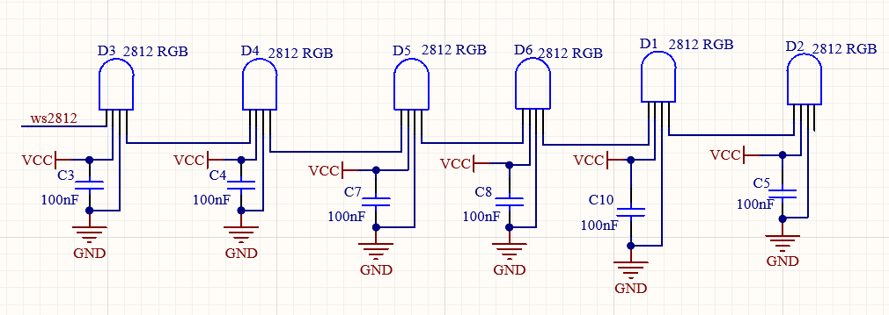
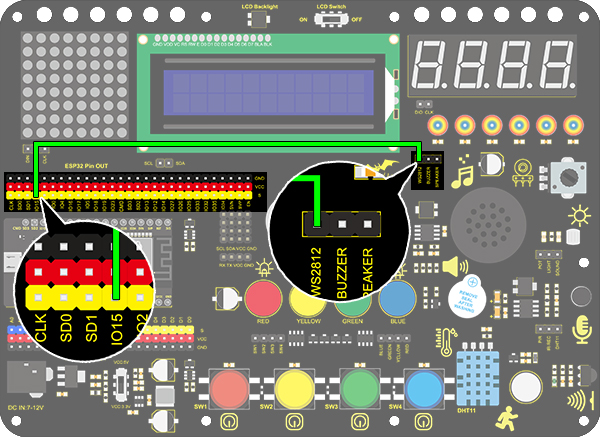
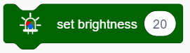
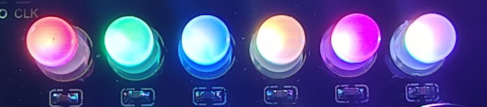
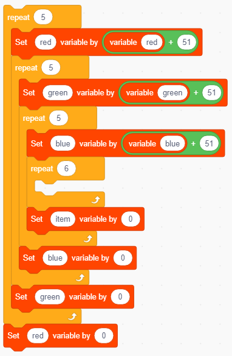
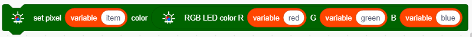
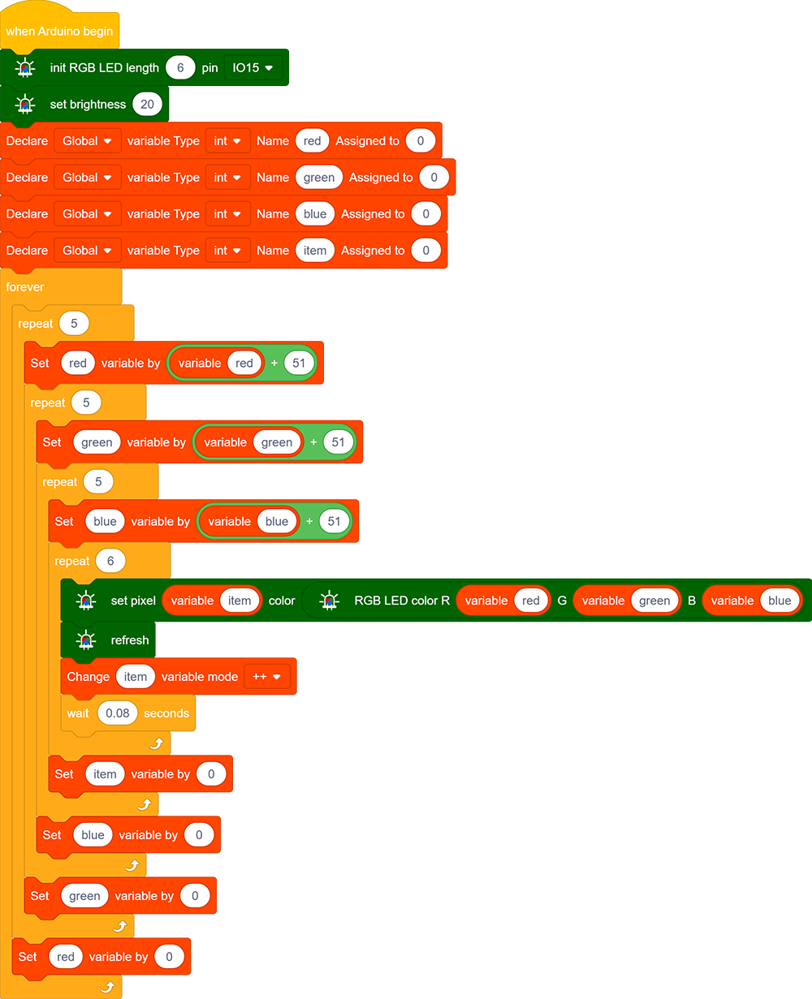
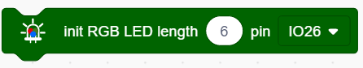
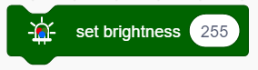

### Progetto 5 Luce Ambientale Arcobaleno

**1. Descrizione**

Il LED 2812RGB è una luce programmabile colorata e suggestiva, il cui colore, luminosità e ritmo sono regolabili. Questa luce ambientale arcobaleno può essere utilizzata come decorazione dinamica a piacimento. Oppure può essere controllata per "danzare con la musica". Importante, può essere migliorata come allarme. Il suo sensore integrato rileva l'ambiente circostante per avvisare gli utenti cambiando colore, luminosità e ritmo.

**2. Principio di Funzionamento**

Il protocollo dati adotta una modalità di comunicazione a codice single-line return-to-zero. Dopo il reset del pixel all'accensione, il terminale DIN riceve i dati dal controller. I primi 24 bit di dati ricevuti vengono estratti dal primo pixel e inviati al registro dati interno.

I dati rimanenti vengono amplificati da un circuito di amplificazione e trasmessi tramite la porta DOUT al pixel successivo in cascata.  
Durante la trasmissione attraverso i pixel, il segnale diminuisce di 24 bit ogni volta.

Inoltre, il pixel adotta una tecnologia di rimodellamento e inoltro automatico, per cui il numero di pixel in cascata è limitato solo dalla velocità di trasmissione del segnale.

**3. Schema di Collegamento**

**4. Codice di Test**

Impariamo come accendere il 2812 RGB e impostarne i colori.

1. Trascina i due blocchi di codice.

2. Trascina il blocco seguente dalla sezione "RGB LED" e imposta il pin su IO15 e il numero di LED a 6.

3. Trascina il blocco seguente dalla sezione "RGB LED" e imposta la luminosità a 20.

4. Trascina i blocchi seguenti e imposta il numero di LED a 0, 1, 2, 3, 4 e 5, quindi scegli i colori rosso, verde, blu, giallo, viola e bianco.

5. Aggiungi il blocco seguente.

**Codice Completo：**

**5. Risultato del Test**

Dopo aver caricato il codice, collegato i fili e acceso l'alimentazione, i LED si illumineranno con colori diversi, come mostrato di seguito:

**6. Espansione della Conoscenza**

In questo progetto di espansione, realizziamo uno mini spettacolo di luci!

Annida quattro blocchi "ripeti" e aggiungi un "variabile +" in essi, quindi azzera le variabili corrispondenti a 0 alla fine di ogni ciclo.

Inserisci le tre variabili sopra nel blocco "RGB" in modo che questi valori di colore siano controllati. Poi aggiungi un modulo di aggiornamento.

Inserisci l'RGB in un blocco "mostra colore" per visualizzare i colori. E definisci una variabile item per controllare il LED visualizzato.

Il modulo forever viene usato per controllare i LED RGB, che cicleranno da 0 a 5 per accendere gradualmente ogni luce.

**Codice Completo**

**7. Spiegazione del Codice**

1. Imposta il numero di 2812 RGB. Un pin della scheda di sviluppo può controllare più LED 2812 RGB, quindi è necessario impostare il numero in anticipo e selezionare il pin collegato.

2. Imposta la luminosità del 2812 RGB. Inserisci un valore di luminosità compreso tra 0 e 255, dove 255 è il massimo.

3. Questo blocco spegne tutti i 2812 RGB.

4. Controlla la visualizzazione dei 2812 RGB. Possiamo compilare gli spazi vuoti per controllare il LED acceso e il suo colore dopo aver selezionato il pin. Per esempio, "0 a 0" significa che si accende solo il primo LED. Dopo aver caricato il codice, il primo LED si accenderà nel colore impostato.

**NOTA:** I due spazi vuoti possono anche essere compilati con variabili, così da poter creare uno spettacolo di luci.

5. Imposta il colore dei 2812 RGB. Il colore visualizzato può essere modulato dai valori di rosso, verde e blu. Possiamo aggiungere questo blocco nelle impostazioni colore del 2812 RGB.

6. Può controllare la visualizzazione di un singolo 2812 RGB inserendo il numero del LED da controllare e selezionando il colore.

7. Il 2812 RGB visualizzerà il colore impostato solo dopo l'aggiornamento.

