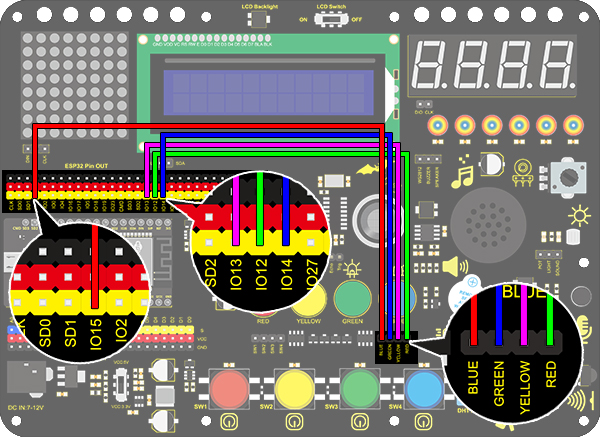
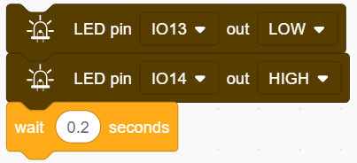

### Proyecto 6 Luz de Flujo de Agua

**1. Descripción**

Este sencillo proyecto de luz de flujo de agua te ayuda a aprender sobre el empaquetado electrónico. En este proyecto, controlaremos LEDs para cambiar el color a una velocidad especificada mediante una placa Arduino.

**2. Diagrama de Conexiones**

**3. Código de Prueba**

Una luz de flujo de agua consiste en una secuencia de iluminación de LEDs de izquierda a derecha.

1. Arrastra los dos bloques básicos de código.

2. Configura el modo del pin a “output”.

3. Arrastra los siguientes bloques de la sección "LED" y configura el pin IO15 en LOW, el pin IO12 en HIGH. Luego establece el tiempo de retardo a 0.2s.

4. Arrastra los siguientes bloques de la sección "LED" y configura el pin IO12 en LOW, el pin IO13 en HIGH. Luego establece el tiempo de retardo a 0.2s.

5. Arrastra los siguientes bloques de la sección "LED" y configura el pin IO13 en LOW, el pin IO14 en HIGH. Luego establece el tiempo de retardo a 0.2s.

6. Arrastra los siguientes bloques de la sección "LED" y configura el pin IO14 en LOW, el pin IO15 en HIGH. Luego establece el tiempo de retardo a 0.2s.

   

**Código Completo：**

**4. Resultado de la Prueba**

Después de subir el código y encender la alimentación, los LEDs se iluminan de izquierda a derecha.