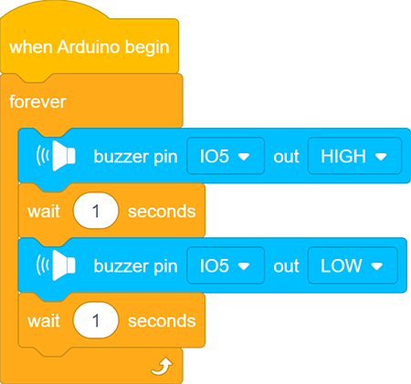

### Project 7 Actieve Buzzer

**1. Beschrijving**

Een actieve buzzer is een component die wordt gebruikt als alarm, herinnering of als een vermakelijk apparaat, en levert een betrouwbare geluidssignaal.

Bovendien maakt het mogelijk om zeer controleerbare geluiden te genereren, waardoor onze projecten interessanter worden.

**2. Werking**

Een actieve buzzer bevat een multivibrator, waardoor hij alleen geluid maakt via DC-spanning. Pin 1 van de buzzer wordt verbonden met VCC en pin 2 wordt aangestuurd door een triode. Wanneer een hoog niveau wordt aangeboden aan de basis (pin 1) van de triode, verbinden de collector (pin 3) en emitter (pin 2) zich met GND, en geeft de buzzer geluid.

Omgekeerd, als we een laag niveau aan de basis geven, worden de overige pinnen losgekoppeld, waardoor de buzzer stil blijft.

**3. Aansluitschema**

**4. Testcode**

Als de ontwikkelkaart een hoog niveau uitstuurt, zal de buzzer geluid maken. Bij een laag niveau stopt de buzzer met klinken.

1. Sleep de twee basis codeblokken.

2. Sleep de volgende blokken uit het onderdeel "Buzzer" en stel de IO5 pin in op HIGH. Stel daarna de vertragingstijd in op 1s.

3. Sleep de volgende blokken uit het onderdeel "Buzzer" en stel de IO5 pin in op LOW. Stel daarna de vertragingstijd in op 1s.

**Volledige code：**

**5. Testresultaat**

Na het uploaden van de code en het inschakelen, geeft de buzzer 1s geluid en blijft daarna 1s stil.

**6. Code-uitleg**

Buzzer output blok. We definiëren eerst de pin als IO5 en stellen vervolgens de output in op "HIGH" of "LOW". De buzzer piept bij HIGH en blijft stil bij LOW.

