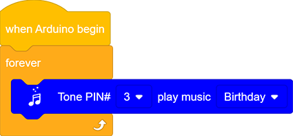
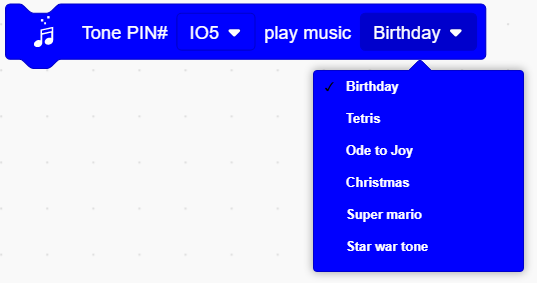

### プロジェクト8 音楽演奏者

**1. 説明**

このプロジェクトでは、パワーアンプスピーカーを使って音楽を再生します。このスピーカーは単純な曲を再生するだけでなく、あなたの望む演奏も可能です。したがって、プロジェクト内で他の面白いコードをプログラムして、素晴らしい学習成果を達成できます。

**2. 動作原理**

電気信号はRP1のピン1から入力されます（信号の強度を調整し、音量にもなります）。
C4でカップリングした後、R5を通過し、信号は8002BのIN-ピンに到達します。ここで信号は演算増幅され、BEE1スピーカーに出力されます。

**3. 配線図**

**4. テストコード**

**5. テスト結果**

コードをアップロードして電源を入れると、アンプは対応する周波数の音階（ド、レ、ミ、ファ、ソ、ラ、シ）を順番に再生します。

**6. 知識の拡張**

誕生日の歌を演奏させてみましょう。ライブラリにはすでにいくつかの曲が追加されているので、「Music」からこれらの曲ブロックを直接ドラッグできます。

**コード:**

**7. コードの説明**

1. 音階の周波数を設定します。ピンを設定した後、周波数を選択して音楽を作曲できます。

2. 音楽モジュールは使いやすさのために6曲をコード内に統合しています。したがって、ピンを設定し、音楽を選択するだけで済みます。

3. 再生停止モジュールは、対応するピンを設定するだけで音楽を停止できます。

