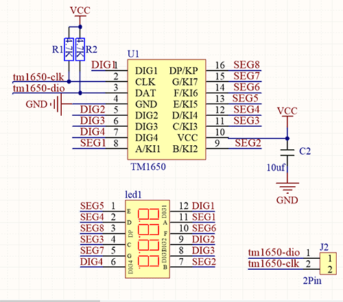
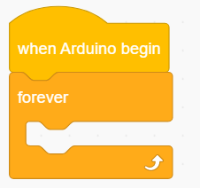
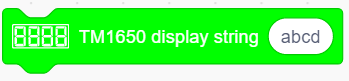
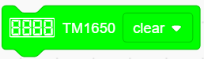

### Projekt 9 Digitalrohr-Anzeige

**1. Beschreibung**

Dieses 4-stellige Rohr-Display ist ein Gerät zur Anzeige von Zählwerten oder Zeit, das Zahlen von 0 bis 9 sowie einfache Buchstaben darstellen kann. Es besteht aus vier Digitalrohren, von denen jedes sieben Leuchtdioden (LED) enthält.

Darüber hinaus können durch Anschluss der Pins an das Arduino-Entwicklungsboard mehrere Funktionen realisiert werden, wie z.B. Zeitmessung und einige Spielespeicherungen.

**2. Funktionsprinzip**

Der TM1650 verwendet das IIC-Protokoll und nutzt zwei Busleitungen (SDA und SCL).

Der Code wird in unseren Blöcken bereitgestellt, und das Digitalrohr zeigt die Zahlen über diesen Code an.

**3. Schaltplan**

**4. Testcode**

Um Zahlen auf dem Display anzuzeigen, müssen Sie nur einen "TM 1650 display"-Block aus "Digital tube" ziehen und die Zahlenfolge auf 9999 setzen.

**5. Testergebnis**

Nach Anschluss der Verkabelung und Hochladen des Codes zeigt das Digitalrohr-Display "9999" an, wie unten dargestellt.

**6. Erweiterter Code**

Lassen Sie uns einige schwierigere Operationen durchführen. Anstatt statischer Zahlen zeigen wir einige dynamische Werte an.

Der folgende Code steuert die Rohre, um Zahlen von 1 bis 9999 anzuzeigen.

1. Ziehen Sie die zwei grundlegenden Codeblöcke.

2. Ziehen Sie den folgenden Block aus "Variables". Setzen Sie den Typ auf int und den Namen auf item, und weisen Sie 0 als Anfangswert zu.

3. Ziehen Sie den folgenden Block aus "Control" und setzen Sie ihn auf 9999 Wiederholungen.

4. Ziehen Sie einen "variable mode" aus "Variables", definieren Sie den Namen als item und setzen Sie den Modus auf "++".

5. Ziehen Sie einen "TM 1650 display"-Block aus "Digital tube" und ersetzen Sie den Zeichenkettenwert durch die Variable item. Fügen Sie danach eine Verzögerung von 0,5 s hinzu.

6. Fügen Sie nach dem "repeat"-Block einen "set variable"-Block hinzu. Setzen Sie die Variable item auf 0. Andernfalls würde der Wert von item nach 9999 Schleifen außerhalb des Anzeigebereichs liegen.

**Vollständiger Code：**

**7. Code-Erklärung**

1. Setzen Sie die Anzeigekette. Geben Sie direkt die Zahlen oder Buchstaben ein, die Sie anzeigen möchten.

2. Stellen Sie das EIN oder AUS dieses TM 1650 Digitalrohrs ein. Jedes Rohr kann separat gesteuert werden.

3. Es ist möglich, die Anzeige zu löschen oder als Hauptschalter zum Ein- oder Ausschalten des Digitalrohrs zu verwenden.

