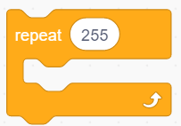
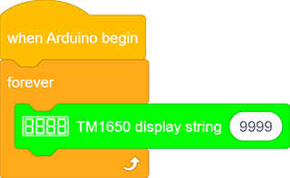
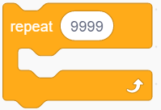
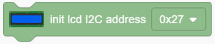
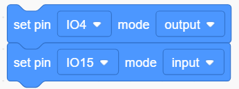

# 4. Kidsblock Tutorial

## 4.1 Data download

Scratch information contains project ,please click to download for follow-up study.

Data download：[Data download](./Scratch.7z)

## 4.2 Install software

### Software installation of Windows System

1. Download kidsblock:  https://xiazai.keyesrobot.cn/KidsBlock.exe

2. software installation

### Software installation of Mac System

1. Download kidsblock: https://xiazai.keyesrobot.cn/KidsBlock.dmg

### Use KidsBlock

1、operating software

First connect the development board to the computer

2、If you are unable to upload the code, please refer to the following tutorial to install the driver (optional reading)

Install driver（Windows)

Install driver（MAC)

## 4.3 Scratch Project（1-15）

### Project 1 LED Blinking

**1. Description**

LED blinking is a simple project designed for starters. You only need to install an LED on Arduino board and upload the code on Arduino IDE. This project reinforces the learning of Arduino conceptual framework and using methods for starters. 

**2. Working Principle**

**LED:** Generally speaking, limited IO ports of output current may cause low brightness of LED, so a NPN triode (Q2) is applied in circuit as a switch. In this case, the LED will light up if the base(pin 1) of triode is at a high level. On the contrary, LED goes off when the base is at low. 

**Triode switch:** Briefly, LED lights up when the base(pin 1) is at a high level. In the same breath, the collector(pin 3) and emitter(pin 2) are connected, and then VCC passes through a current-limiting resistor to LED and finally to GND, which forms a circuit. On the contrary, LED goes off when the base is at low. In this circumstance, the collector and emitter are disconnected  and the LED lights off.

**3. Wiring Diagram**

**4. Test Code**

According to previous principles, we can control LED via levels of pins on the development board.

1. Drag  the following block in "Events" part. 

2. Drag the following block  in "Control" part . 

3. Drag the following block  in "Pins" part and set the IO5 pin to output.

   

4. Drag the following block  in "LED" part and set the IO5 pin to HIGH.

5. Drag the following block  in "Control" part . 

6. Drag the following blocks and set the IO5 pin to LOW. 

**Complete Code：**

**5. Test Result**

After uploading the code and powering on, LED will be on for 1s and off for 1s.

**6. Code Explanation**

Note: Pin mode must be set to "output"  when using LED module.

1. Code blocks will not execute if the following block is not exist.

2. Code blocks in  the following block will execute in a loop.

3. It is a module used to set the pin mode(control LED and buzzer for “output” mode, and read sensor module for “input” ).

4. It is a module used to set the pin and the levels("HIGH" and "LOW").

5. It is a module used to set the delay time.

### Project 2 Breathing LED

**1. Description**

Arduino breathing led utilizes on-board programmable PWM to output analog waveform. After powering on, LED brightness can be adjusted through duty cycle of the waveform to eventually realize the effect of breathing led. 

In this way, ambient light can be simulated by changing LED brightness over time. Also, breathing led can form a colorful mini light to construct a tranquil and warm environment.

**2. What is PWM?**

PWM controls analog output via digital means, which is able to adjust duty cycle of the wave (a signal circularly shifting between high level and low level).

For Arduino, digital ports of voltage output are LOW and HIGH, which respectively correspond to 0V and 5V. Generally, we define LOW as 0 and HIGH as 1. Arduino will output 500 signals of 0 or 1 within 1s. If they are "1", 5V will be output. Oppositely, if they are all 0, the output will be 0V. Or if they are 010101010101..., the average output will be 2.5V. 

In other words, output ratio of 0 and 1 affects the voltage value, the more 0 and 1 signals are output per unit time, the more accurate the control will be. 

**3. Wiring Diagram**

**4. Test Code**

We adopt "for" statement to increase a variable from 0 to 255, and define the variable as PWM output (analogWrite(pin, value)). By the way, a delay time may reinforce the control of LED shining time. Next, we use another "for" statement to decrease it from 255 to 0 with a delay time to control LED dimming process. 

1. Drag the two code blocks.

2. Drag the following block from "Variables" part, and define the name to "item" with an initial assignment "0". Put this block in "forever" block. 

3. Drag  the following block from "Control" part and set it to 255 times, which is the maximum value of PWM.

4. Drag the following block from "Variables" part, put "item" as its changed object and set the mode to "++".

5. Drag the following block from “LED” part and set the LED pin to IO5. Then add an "variable" block in it and fill in the blank with "item". 

6. Drag the following block from "Control" part and set the time to 0.01s , that is 10ms. 

7. According to previous steps, build another code block with the only difference of variable mode "– –".

**Complete Code：**

**5. Test Result**

After uploading the code, we can see the LED dims gradually. It "breathes" evenly.

**6. Code Explanation**

1. This block is used to set variable usable range, variable type , name and its initial value.

2. Repeating times can be assigned in the blank of this repeat block. 

3. Input a variable name in the blank and its value will add 1 each time the code executes. "++" can be altered to "– –".

4. Input a variable name in the blank and its value will reduce 1 each time the code executes.  "– –" can be altered to "++" . 

5. This is a PWM output module, and the white box is the value of the output PWM.

### Project 3 SOS Distress Device

**1. Description**

SOS device is able to emit distress signals, which coincides with the principle of Morse code. It is convenient for emergencies.

**2. Wiring Diagram**

**3. Test Code**

What we should clear firstly is how SOS distress light blinks: LED quickly blinks 3 times for “S” and slowly blinks 3times for “O”. 

And then, we control the blinking times and duration via "for" statement and set interval time among letters. 

1. Drag the two code blocks.

2. Drag the following block  in "Pins" part and set the IO5 pin to output.

**Letter "S"**

3. Drag the following block from "Control" part and set to 3 times, as "S" means blink for 3 times. 

4. Drag the following blocks from "LED" part and set the IO5 pin to HIGH. Then set the delay time to 0.15s. 

5. Drag the following blocks from "LED" part and set the IO5 pin to LOW. Then set the delay time to 0.1s.  

**Letter O**

6. Refer to previous steps to build the following code blocks. Modify the HIGH ouput to delay 0.4s and LOW to 0.2s.   

**Letter S**

7. Operate step 3 ,4 and 5 again. 

8. Add a delay time of 5s to the end, and "SOS" will repeat every 5s.   

   

**Complete Code：**

**4.Test Result**

After uploading the code, LED respectively blinks for 3 times quickly and slowly.

### Project 4 Traffic Light

**1. Description**

The traffic light module is a device used to control the route of pedestrians and vehicles. It includes a red, a yellow and a green light, which implies different instructions.

**Red for Stop:** Pedestrians and vehicles stop proceeding.

**Yellow for Caution:** Pedestrians and vehicles are ready for stopping. If the drive is already in process, the speed should be slow. 

**Green for Proceed:** Pedestrians and vehicles keep going with the abidance of traffic regulations. 

In this project, you can use Arduino to write code to control traffic lights. For instance, set the duration of each lights and the interval time among them. Besides, you may also add a timer to alter light colors to schedule. 

**2. Wiring Diagram**

**3. Test Code**

We simply stimulate the traffic lights: green LED lights up for 5s, yellow LED blinks for 3 times, and red LED lights up for 5s. And we set this to loop. 

The blinking of yellow LED can utilize for()statement we have mentioned in project 3. Thus, we only need to set the lighting time to complete a traffic light. 

1. Drag the two code blocks.

2. Set the pin mode to “output”

3. Drag the following blocks from "LED" part and set the IO27 pin to HIGH and then LOW. Then set the delay time to 5s.    

4. Drag the following blocks from "Control" part and set the repeat time to 3, then set the IO26 pin to HIGH and then LOW. Then set the delay time to 0.5s.   

5. Repeat step 3, and set the pin to IO25.

**Complete Code：**

**4. Test Result**

After uploading the code, green LED will light up for 5s, yellow LED will blink for 3 times, and red LED will be on for 5s.

### Project 5 Rainbow Ambient Light

**1. Description**

2812RGB LED is a programable colorful dreamy light, whose color, brightness and rhythm are adjustable.  This rainbow ambient light can be used as a dynamic decoration at will. Or you may control it to "dance with music". Importantly, it can be improved as an alarm. Its built-in sensor detects the ambient surroundings to warn users by changing  its color, brightness and rhythm.

**2. Working Principle**

The data protocol adopts communication mode of single-line return-to-zero code. After the pixel is reset on power, DIN terminal receives data from the controller. The firstly arriving 24bit data will be extracted by the first pixel and be sent to the inner data register. 

Remaining data will be amplified by an amplification circuit and be transmitted through DOUT port to the next cascaded pixel. 
Being transmitted through pixels, the signal decreases 24bit each time. 

Besides, The pixel adopts automatic shaping and forwarding technology, insomuch that the cascade number of the pixel is only limited by the signal transmission speed.

**3. Wiring Diagram**

**4. Test Code**

Let's learn how to light up 2812 RGB and set its colors. 

1. Drag the two code blocks.

2. Drag the following block from "RGB LED" part and set the pin to IO15 and the number of LED to 6.

3. Drag the following block from "RGB LED" part and set brightness to 20. 

4. Drag the following blocks and set the number of LED to 0 ,1, 2, 3, 4 and 5, then choose red, green, blue, yellow, purple and  white colors. 

5. Add the following block.

**Complete Code：**

**5. Test Result**

After uploading code, connecting the wiring and powering on, the LED will light up in different colors, as show below:

**6. Knowledge Expansion**

In this expansion project, let's make a mini light show!

Nest four "repeat" blocks and add a "variable +" in them, then clear the corresponding variables to 0 at the end of each loop. 

Put the above three variables in "RGB" block so that these color values are controlled. Then add a refresh module.

Put the RGB in a "show color" block to display colors. And define a variable item to control the displayed LED.

The forever module is used to control RGB LEDs, which will cycle from 0-5 to gradually light up each light.

**Complete Code**

**7. Code Explanation**

1. Set the number of 2812 RGB. A development board pin can control multiple 2812 RGB LEDs, so we need to set the number in advance and select the connected pin. 

2. Set the brightness of 2812 RGB. Input the brightness value within 0-255, in which 255 is the brightest.

3. This block will turn off all 2812 RGBs. 

4. Control the display of 2812 RGBs. We can fill the blanks to control the lighting LED and its color after selecting the pin. For instance, "0 to 0" means only the first LED lights up. After uploading the code, the first LED will turn on in the set color.

**NOTE:** The two blanks also can be filled with variables, so that a light show is able to be formed. 

5. Set the color of 2812 RGBs. The displayed color can be modulated by the value in red, green and blue. We can add this block in the color settings of 2812 RGB.

6. It can control a single 2812 RGB display via enter the control led number and select the color.

7. The 2812 RGB will display the set color only after refreshing

### Project 6 Water Flow Light

**1. Description**

This simple water flow light project enables to help you learn electronic packaging. In this project, we will control LEDs to change the color in a specified speed via a Arduino board.

**2. Wiring Diagram**

**3. Test Code**

A water flow light consists of a stream of LED lighting from left to right.

1. Drag the two basic code blocks.

2. Set the pin mode to “output”.

3. Drag the following blocks from "LED" part and set the IO15 pin to LOW, the IO12 pin to HIGH. Then set the delay time to 0.2s.  

4. Drag the following blocks from "LED" part and set the IO12 pin to LOW, the IO13 pin to HIGH. Then set the delay time to 0.2s.  

5. Drag the following blocks from "LED" part and set the IO13 pin to LOW, the IO14 pin to HIGH. Then set the delay time to 0.2s. 

6. Drag the following blocks from "LED" part and set the IO14 pin to LOW, the IO15 pin to HIGH. Then set the delay time to 0.2s.  

   

**Complete Code：**

**4. Test Result**  

After uploading code and powering on, the LEDs light up from left to right.

### Project 7 Active Buzzer

**1. Description**

An active buzzer is a component used as an alarm, a reminder or an entertaining device, which boasts a reliable sound. 

What's more, it empowers to stimulate highly controllable sounds, making our projects more interesting.

**2. Working Principle**

An active buzzer integrates a multi-vibrator, so it makes sound only via DC voltage. Pin 1 of the buzzer connects to VCC and pin 2 is controlled by a triode. When a high level is provided for the base (pin 1) of the triode, its collector (pin 3) and emitter (pin 2) link to GND, and then the buzzer emits sound. 

Oppositely, if we offer a low level to the base, the rest of pins will be disconnected, so the buzzer will remain quiet.

**3. Wiring diagram**

**4. Test Code**

If the development board outputs a high level, the buzzer will emit sound. If it outputs a low level, the buzzer will stop ringing.

1. Drag the two basic code blocks.

2. Drag the following blocks from "Buzzer" part and set the IO5 pin to HIGH. Then set the delay time to 1s. 

3. Drag the following blocks from "Buzzer" part and set the IO5 pin to LOW. Then set the delay time to 1s. 

**Complete Code：**

**5. Test Result**

After uploading code and powering on, the buzzer emits sound for 1s and stays quiet for 1s.

**6. Code Explanation**

Buzzer output block. We firstly define the pin to IO5 and then set the output to "HIGH" or "LOW". The buzzer will beep when at HIGH, while it will be quiet at LOW.

### Project 8 Music Performer

**1. Description**

In this project, we will use a power amplifier speaker to play music. This speaker can not only play simple songs, but also perform what you desire. Thus, you can program other interesting codes in the project to accomplish splendid learning outcomes.

**2. Working Principle**

The electrical signal is input from pin 1 of RP1 (adjusts signal intensity, which is also the sound volume).
After coupling in C4 and passing R5, the signal reaches IN- pin of 8002B, in which it is operationally amplified and output to BEE1 speaker. 

**3. Wiring Diagram**

**4. Test Code**

**5. Test Result**

After uploading code and powering on, the amplifier circularly plays music tones with corresponding frequency: DO, Re, Mi, Fa, So, La, Si.

**6. Knowledge Expansion**

Let's make it play a birthday song. We have already added some songs in library so you can directly drag these song blocks from "Music". 

**Code:**

**7. Code Explanation**

1. Set the tone frequency. After setting the pin, we can select the frequency to compose music.  

2. Music module, for the convenience of use, we have integrated 6 pieces of music in the code, thus, we just need to set the pin and select the music.

3. Stop playing module, we only need to set the corresponding pin to stop the music.

### Project 9 Digital Tube Display

**1.  Description**

This 4-Digit tube display is a device used to display counting or time, which is able to  display numbers from 0 ~ 9 and simple letters. It consists of four digital tubes, each of which has seven light-emitting diodes (LED). 

Moreover, multiple functions can be realized by connecting their pins to the Arduino development board, such as timekeeping and some game storing. 

**2. Working Principle**

TM1650 utilizes IIC protocol and adopts two bus lines (SDA and SCL).

The code is provided in our blocks, and the digital tube will display numbers via this code. 

**3. Wiring Diagram**

**4. Test Code**

To show numbers on the display, you only need to drag a "TM 1650 display" block from "Digital tube" and set the number string to 9999.

**5. Test Result**

After connecting the wiring and uploading code, the digital tube display shows "9999", as shown below.

**6. Extended Code**

Let's have some difficult operations. Rather than static numbers, we handle it to show some dynamic ones. 

The following code manipulates the tubes to display 1~9999.

1. Drag the two basic code blocks.

2. Drag the following block from "Variables". Set the type to int and name to item, and assign 0 as its initial value.

3. Drag the following block from "Control" and set to 9999 times.  

4. Drag a "variable mode" from "Variables", define its name to item and set the mode to "++".

5. Drag a "TM 1650 display" block from "Digital tube" and replace the string value with variable item. Add a delay time of 0.5s after it. 

6. Add a "set variable" block after the "repeat" block. Set item variable by 0. Otherwise, the item value will be out of display range after 9999 loops.

**Complete Code：** 

**7. Code Explanation**

1. Set the display string. Directly type numbers or letters you want to display in the blank.

2. Set the ON or OFF of this TM 1650 digital tube. Each tube can be controlled separately. 

3. It is able to clear the display or used as a master switch to turn on or turn off the digital tube. 

### Project 10 Dot Matrix Display

**1. Description**

This module consists of a 8x8 LED dot matrix with one control pin for each row as well as each column to adjust the brightness of LED. Connecting with Arduino board, the brightness of LED is controlled to display characters and figures via Arduino programming. In this way, simple characters, numbers and figures are able to be displayed. It also can be applied in game machines or screens.

MAX7219 is an IC with SPI communication and can be used to control the 8x8 dot matrix. The MAX7219 SPI communication has integrated in our libraries and you can recall directly.

**2. Wiring Diagram**

**3. Test Code**

1. Drag the two basic code blocks.

2. Drag a "init matrix display" from “Matrix” and set CS to IO15. DIN and CLK are fixed pin respectively to IO23 and IO18.

3. Drag a "set brightness" block and set it to 3.

4. Drag a "image" block and choose heart icon.

5. Add a "refresh" block at the end.

**Complete Code：**

**4. Test Result**

After connecting the wiring and uploading code, a heart will be displayed on the dot matrix, as shown below.

**5. Code Explanation**

1. Set the CS pin. In the code, DIN is fixed to io23 and SLK to io18, while CS pin is optional. For convient wiring, we select io15.

2. Draw pixels. This code block will light up or turn off pixels on the dot matrix by axis x and y, with red for on and black for off.

3. Draw line. Locate the line by two group of coordinate points, also with red for on and black for off. 

4. Show characters. We have add character libraries so you only need to type a letter to display it on the dot matrix. Besides, it must be used cooperatively with a "rotation 180°" block. 

5. Show numbers. Similarly, you only need to type a number to display it on the dot matrix, and it also must be used cooperatively with a "rotation 180°" block. 

6. Show scrolling character strings. Collocating a "rotation 180°" block, the specified scrolling strings will be displayed after setting its speed. 

7. Display image. For convenience, we have already integrated some emotion icons which can be selected directly. 

8. Display fill colors. You may set to black (LED goes off) or red(LED lights up).

9. Refresh the display. The dot matrix must be refreshed if it displays something. Or else, an error may occur.

10. Set the brightness. You can lower the brightness when debugging to avoid offending to your eyes.

11. Set rotation angles. For high compatibility with more code, some data and icons need a rotation with the avoidence of inverted display.  That is why a "rotation 180°" block is necessary in codes. 

### Project 11 LCD

**1. Description**

Arduino I2C 1602 LCD is a commonly-used auxiliary device for MCU development board to connect with external sensors and modules. It features a 16-bit wide character, 2-line LCD screen and adjustable brightness. This programable module is convenient for data editing, display and management . Besides, it can display not only characters and figures but sensors value, like temperature, humidity or pressure value. 

As a result of its usability, the display is wildly applied in many fields, including smart home products, industrial monitoring systems, robot control systems and automotive electronics systems.

**2. Working Principle**

It is the same as IIC communication principle. Underlying functions have been packaged in libraries so that you can recall them directly. If you are interested in these, you may have a further look of underlying driving principles. 

**3.  Wiring Diagram**

**4. Test Code**

1. Drag the two basic code blocks.

2. Drag “init LCD” block from “LCD” and set the I2C address to 0x27.

3. Drag the "LCD back light" block and set it to ON. Characters are not easy to read if there is no back light.

4. Drag a "LCD cursor position" block and set x to 3 and y to 0. Add an "LCD print" block and type “keyestudio” in the blank. 

5. Drag a "LCD cursor position" and set x to 2 and y to 1. Add an "LCD print" and type “Hello,world!” in the blank.

**Complete Code：**

**5.  Test Result**

After connecting the wiring and uploading code, turn on the LCD, and "Hello, world!" and "keyestudio!" will be displayed on the LCD.

If the characters are unclear, please fix the backlight potentiometer by the small slotted screwdriver.

**6. Code Explanation**

1.  Set the IIC communication address. In this project, the address of LCD 1602 is 0x27.

2. Control the LCD backlight. The displayed characters will be seen much clearly if the back light is on. 

3. Set the cursor position. It will provide an accurate position through axis x and y. Possible values are X: 0-15 and Y: 0-1.

4. Print characters on LCD. The blank can be filled with characters or variables, which is convenient for displaying the values from sensors and modules. 

5. Blink the cursor at the display position. By default, the cursor is in inactive. 

### Project 12 Servo

**1. Description**

This servo features high performance and high precision with a maximum rotation angle of 180°. Weighting only 9g, it is perfectly suitable for any mini device in multiple occasions. What's more, it enjoys short startup time, low noise and strong stability.

**2.  Working Principle**

**Angle range:** 180° (360°, 180° and 90°)

**Drive voltage:** 3.3V or 5V

**Pin:** Three wires

**GND:** Grounded(brown)

**VCC:** A red pin that connects to a +5v (3.3V) power

**S:** A orange signal pin that controlled via PWM signal

**Control Principle**: The rotation angle is controlled via duty cycle of PWM. Theoretically, standard PWM cycle is 20ms(50Hz), so pulse width should distribute within 1ms~2ms. However, the actual pulse width reaches 0.5ms~2.5ms, which corresponds to 0°～180°. Pay attention that, for the same signal, the rotation angle may vary from servo brands.

**3. Wiring Diagram**

**4. Test Code**

1. Drag the two basic blocks and put a "variable" block between them. Set the variable type to int, name to angle, and assign 0 as its initial value. 

2. **Servo gradually rotates from 0° to 180°:** 

Add a repeat block and set the repeat times to 180(180 angles). Drag a "change variable" and a "servo" block and put them in the repeat one. Name the variable "angle" and select the mode "++". Set Servo PIN to IO4 and degree to the named variable. Don't forget to delay 15s.

3. **Servo gradually rotates from 180° to 0°:** Repeat step 2, but set the variable mode to "- -".

**Complete Code：**

**5.  Test Result**

After connecting the wiring and uploading code, the servo starts to rotate from 0° to 180° and then from 180° to 0°.

**6. Code Explanation**

1. Set the values of Servo. Servo pin and rotation angle can be controlled by setting parameters on this block.

2. Read the current degree of the Servo. 

### Project 13 Mini Lamp

**1. Description**

In this project, we are going to control a lamp via Arduino UNO and a button. When we press the button, the state of the lamp will shift(ON or OFF).

**2. Working Principle**

When the button is released, a voltage VCC passing through R29 provides a high level for S terminal. When pressed, pin 1 and 3, pin 2 and 4 are connected and voltage on S1 arrives GND as a low level. At this moment, R29 avoids a short circuit between VCC and GND.

**3. Wiring Diagram**

**4.  Test Code**

1. Add two basic blocks.

2. Drag a "baud rate" from “Serial” and set it to 9600. 

3. Then drag a "print" block from “Serial”, type “Key status:” in the blank and set it to "no-warp".

4. Set the IO15 pim to “input”.

5. Drag another “Serial print” block  from “Serial” and set the mode to "warp". Add a "state value of button" from “Button” and set the pin to IO15.

**Complete Code:**

**5. Test Result**

After connecting the wiring and uploading code, open the serial monitor and set the baud rate to 9600. 
When we press the button, serial port prints "Key status: 0"; When we release the button, serial port prints "Key status: 1".

**6. Knowledge Expansion**

Next, we will control the LED through the state of buttons. 

**Flow Chart：**

**Wiring Diagram：**

**Code:**

1. Drag two basic blocks. 

2. Set the LED pin to “output”，and the button pin to “input”.

3. Drag a "if else" block from “Control”. Add a "button pin" block from “Button” after "if" and set its pin to IO15. Put an "LED output" block under "if" and set the output to HIGH, and put another under "else" and set to LOW. LED pins are both at IO4.

**Complete Code:**

**8. Code Explanation**

**Note: Pin mode must be set to "input" when using the button module.**

1. Judge whether the button is pressed. If so, this block expresses true.

2. Read the button value. When the button is not pressed, the value is 1. Or else, it is 0.

3. If the condition in the hexagon is true, "if" block will be executed. Otherwise, the program runs "else" according to block.

4. Set the baud rate. Please guarantee the serial baud rate fit the counterpart of serial monitor, or it won't print anything. The commonly used baud rate are 9600 and 115200, and here we set to 9600.

5. Print characters on serial monitor. The printed words are what you type in the blank. Besides, three print modes are included: warp, no-warp and HEX (hexadecimal). 

### Project 14 Counter

**1. Description**

Arduino 4-bit digital tube counter can record numbers within 0~9999. It features display speed, count mode adjustment as well as reset function. This module is wildly applied in real-time counter (such as button-press and DC motor rotation count), gaming and experiment equipment.

**2. Flow Chart**

**3. Wiring Diagram**

**4. Test Code**

1. Drag the two basic blocks.

2. Set the button pin to “input”.

3. put a "variable" block. Set the variable type to int and name to item. Assign 0 as its initial value. 

4. Drag an "if" block from “Control” (it executes only when its condition is satisfied). Put a “Button pressed” block from “Button” to the condition box(the hexagon one) and set the pin to IO19. Drag a "variable mode" block and put it after "then", and define it as "item" and set the mode to "++".

5. Repeat step 4, but set the interface to IO18 and mode to "– –".

6. Drag another "if" block from “Control” and define its condition that "interface IO17 button was be pushed?". Put a variable setting block after "then" and set the "variable by 0".

7. Drag a "if" block from “Control”. Find the "＞" block in “Operators” and fill the left blank with "variable item" and the right with "9999". Also, put a variable setting block after "then" and set the "variable by 0".

8. Drag a "TM1650 display" block from "Digital tube" and set the displayed string to "variable item" block. Finally, don't forget to add a 0.2s delay. 

**Complete Code:**

**5. Test Result**

After connecting the wiring and uploading code, press green button to add 1, yellow to minus 1, and red to reset. 

**6. Code Explanation**

**">"** block is used for judgment between two values. These two blanks can be replaced with either numbers or variables. 

### Project 15 Responder

**1. Description**

This programmable responder inputs and receives signals through Arduino development board and a group of buttons, and it judges the correctness of answers via a LED. It is a good object to exercise students' reaction ability and draw their attention to questions. If the answer is correct, the respondent obtains a lot scores. 

Moreover, it simplifies teachers' manipulation of question-grabbers and cuts answer clutters. It may even stimulate students' interests in learning. 

**2. Flow Chart**

**3. Wiring Diagram**

**4. Test Code**

1. Drag the two basic blocks and put a "variable" block between them. Set the variable type to int and name to item with an initial assignment of 0. Set the LED pin to “output”, and the button pin to “input”.

2. Add an "LED output" block, define its pin to IO27 and set the output to HIGH. 
3. Drag an "if" block and add the condition "interface IO19  button was be pushed?".

4. Add a variable setting and four LED output blocks under "then". Among them, we name the variable "item" with an assignment of "0", and set all outputs to LOW respectively at pin 12,13,14 and 27 (The responder works only when all LED light off). Likewise, don't forget a 0.2s delay. 

5. Add a "repeat until" block and set the "until" to "item = 1", as shown below. When item = 1, exit the loop. 

6. Drag another "if" block and set the condition "Interface IO16 button was be pushed?". Add an "LED output" block under "then" and set the output to HIGH at pin IO12. And add a "set item variable by 1" to exit this condition block. 

7. Repeat step 6, but set interface to IO17 and LED pin to IO13. 

8. Operate step 6 again, but set interface to IO18 and LED pin to IO14.

**Complete Code:**

**5. Test Result**

Connect the wiring and upload the code. The answers of respondents are only valid when the red LED is off(red button is pressed). 

When someone presses his/her button(yellow, green or blue), the appropriate LED as well as the red counterpart light up. By now, rest of LED cannot turn on when pressing buttons. The responding action can be performed only when the red button is pressed again. 

**6. Code Explanation**

1. Condition loop module. When the conditions in the diamond box of the module are met, the loop will exit .

2. "=" block is used to judge whether the two values are equal.

