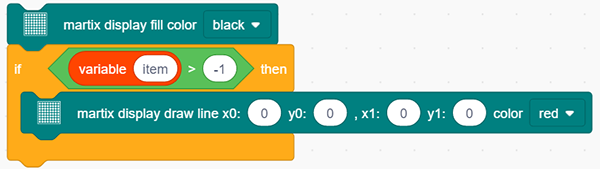
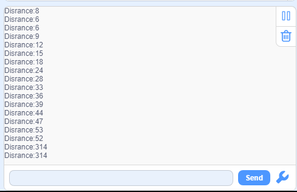
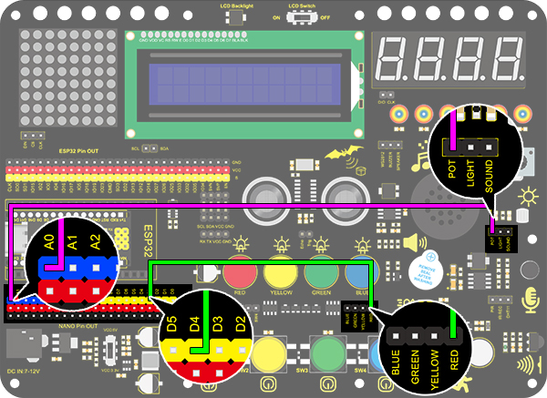

## 4.3 Scratch Project（16-30）

### Project 16 Timebomb

**1. Description**

This project will give you an opportunity experience an interesting timebomb game.  

In this project, the dot matrix represents your timebomb, while the digital tube displays remaining time. Buttons can not only control the bomb but also set its time. You may set a countdown to control this bomb, and it explodes when the countdown is over. Beyond that, a buzzer is adopted to alarm. 

Anyhow, by programming on multiple sensors, your comprehensive capability of logic thinking can be enhanced. 

**2. Flow Chart**

**3. Wiring Diagram**

**4. Test Code**

1. Drag the two basic blocks.

2. Set the button pin to “input”.

3. Add an "init matrix display" block from "Matrix" and set the pin CS to IO15. What follows it are a "brightness" block with its value of 3 and a "variable" block (set variable type to int and name to item, assign 0 as its initial value).

4. In "Matrix", drag a "fill color" block and select "black"(i.e. all LED go off to clear previous display). Add a "display image" to define a smile face. Then, put a refresh block to renew the display. 

5. Drag an"if" block and fill the condition box with "interface IO33 button was be pushed?". Add a "variable mode" block after "then" and set its name to item and mode to "++".

6. Repeat the operation in step 5, but set the interface to IO32 and the mode to "- -".

7. Drag an "if" block to judge whether pin IO26 is pushed. In this "if", we add a repeat block and set its condition to "item" = 0 . 

In the "repeat until" loop, put a "variable mode" and set "item" to "- -", as shown below. Drag a "TM1650 display" block from "Digital tube" and define the showing string as "variable item" block. Then add a "buzzer output" block and set output to HIGH at pin IO27 followed by a 0.5s delay. Re-operate the last procedure but set the output to LOW. 

8. Program another loop code and define the condition as "interface IO25 button was be pushed?". The following executions are in this loop. Put a "TM1650 display" block and define the showing string as "variable item" block.  Then repeat step 4 but here we set the image to a crying face. 

9. Drag an "if then" block and fill the blank with a condition: item ＞ 9999. Add a statement "set item variable by 0" in this condition block. 

10. Drag a "TM1650 display" from "Digital tube" and define the showing string as "variable item". For the same, don't forget to delay 0.2s.

**Complete Code:**

**5. Test Result**

After connecting the wiring and uploading code, press blue button to add time, green to reduce and red to reset. Press yellow button for counting down. When it is over, the bomb explodes. 

### Project 17 Invasion Alarm

**1.  Description**

This invasion alarm system is able to detect invaders in houses or small offices and warn the host to take measures in time. 

In this project, the sensor monitors a certain area. Some device on Arduino board will trigger LED to light up and buzzer to beep for caution if a movement is detected in that zone. What's more, its sensibility is adjustable for a more accurate detection. 

Virtually, this module features practicability, easy installation and low costs. With the exception of home and office, it also applies to factories, warehouses and markets, which, to a large extent, protects property security.

**2. Working Principle**

Human body(37°C) always emits infrared ray with a wavelength of 10μm, which approximates to that of the sensor detected. 

On this account, this module is able to detects human beings movement. If there is, PIR sensor outputs a high level about 3s and, it outputs a low level. 

**3. Wiring Diagram**

**4. Test Code**

1. Add the two basic blocks and drag a "baud rate" block from “Serial” between them. Set the serial baud rate to 9600.

2. Add an "if else" block. Put a "read PIR motion sensor" block in the hexagon box and set the interface to IO5, thus it will determine whether there is a human motion. Add two "serial print" blocks after "then" and "else" and set both modes to "warp". If the condition is satisfied, print “Someone Invaded”. Or else, print “No one”, then add a 1s delay time.

**Complete Code:**

**5. Test Result**

After connecting the wiring and uploading code, open serial monitor to set baud rate to 9600. When the sensor detects movement, the serial port prints "Someone Invaded", or else, it prints “No One”.

**6. Expansion Code**

Let's make an invasion alarm. When the PIR sensor detects human, LED lights up and the buzzer emits sound. In contrast, LED goes off and the buzzer stays quiet. 

**Flow Chart：**

**Wiring Diagram：**

**Code：**

**7.Code Explanation**

When PIR senses human motions, it outputs a high level. Therefore, we can judge whether there is a movement by reading the development board pin connected to this sensor. 

### Project 18 Beating Heart

**1. Description**

In this project, a beating heart will be presented via an Arduino board, a 8X8 dot matrix display, a circuit board and some electronic components. By programming, you can control the beating frequency, heart dimension and its brightness. 

**2. Wiring Diagram**

**3. Test Code**

1. Drag the two basic blocks. 

2. Initialize the dot matrix display. Set the CS pin to IO15 and its brightness to 3. Put these two executions between the basic blocks.

The following executions are all in "forever" block.

3. Clear the display. Control the display to draw lines and establish coordinates system and its origin as the following. Then, refresh the display to show the smaller heart with a delay of 1s. 

4. Repeat step 3 but draw lines as the picture below to show a bigger heart. 

**Complete Code:**

**4.  Test Result**

After connecting the wiring and uploading code, the two sizes of hearts are displayed alternately. 

### Project 19  Dimming Lamp

**1. Description**

The dimming lamp adjusts the brightness of LED via a potentiometer and an Arduino controller. The brightness is subject to resistance value, which can be read and adjusted by connecting the ends of the potentiometer to digital or analog pins on board. 
What's more, this system is applied to control voltage or current of other devices such as fans, bulbs and heaters. 

**2. Working Principle**

Essentially, potentiometer is an element that can change the value of resistance. According to Ohm's law(U=I*R), the resistance affects the voltage. Our potentiometer is 10K.

In this project, the maximum resistance is 10K. The ESP32 board will equally divide the voltage of 3V into 4095 parts (3/4095=0.0007326007326). The analog voltage is obtained by multiplying the read value and 0.0007326007326. 

**3. Wiring Diagram**

**4. Test Code**

The analog value of the potentiometer can be read:

1. Drag the two basic blocks. Put the baud rate setting block between them and set to 9600.

2. Add a "serial print" block in "forever" loop, and select "warp" as the print mode.

3. Drag a "read the value" from “pot” to the serial print, and set the pin to IO33. 

**5. Test Result**

After connecting the wiring and uploading code, open serial monitor to set baud rate to 9600, and the analog value will be displayed within the range of 0-4095.

**6. Expansion Code**

We will control the brightness of LED via a potentiometer. As we know, it is influenced by PWM. However, the range of analog value is 0-4095 while that of PWM is 0-255. Thus, a "map(value, fromLow, fromHigh, toLow, toHigh)" function is needed.

**Wiring Diagram：**

1. Drag the two basic blocks.
2. Add a variable block and set it to local. Select "int" as its type and name it as "pot". 

3. Drag a "map" function from “Data” and put it to the assignment position. Set the value of "map" to "read the value of pot IO33", whose range is from (0,4095) to (0,255).

4. Finally add an "LED analogWrite" block. Set the pin to IO25 and analog value to the variable "pot".

**Complete Code:**

**7. Code Explanation**

1. **map** function. The analog value range can be converted from 0-4095 to 0-255. 

2. Read the analog value of potentiometer by setting its pin. 

### Project 20 Light Pillar

**1.  Description**

The resistance(less than 1KΩ) of the photoresistor varies from the light, thus it can control the brightness of the dot matrix. When controlling, we connect this resistor to an analog pin on the board to monitor the change of resistance. In this way, the light automatically controls the brightness of the display. 

Besides,  the photoresistor is widely applied to our daily life. For instance, a curtain automatically opens or closes according to the outer light intensity. 

**2. Working Principle**

When it is totally in dark, the resistance equals 0.2MΩ, and the voltage at signal terminal (point 2) approaches to 0V. The stronger the light is , the smaller the resistance and voltage will be.

**3. Wiring Diagram**

**4. Test Code**

The analog value of the photoresistor can be read:

1. Drag the two basic blocks. Put the baud rate setting block between them and set to 9600.

2. Add a "serial print" block in "forever" loop with the mode "warp".

3. Drag a "read the value" block from “Light” to the "serial print" block, and set the pin to IO33.

**5. Test Result**

After connecting the wiring and uploading code, open serial monitor to set baud rate to 9600, the analog value will be displayed, within the range of 0-4095.

**6. Expansion Code**

In this expansion project, we use this photoresistor to sensing the ambient light intensity. The middle two columns are included in this experiment to represent light intensity. The lighter it is, the more the lighting LED will be. This forms a "light pillar".

**Wiring Diagram：**

1. Drag the two basic blocks. 

2. In "Matrix", initialize the dot matrix display and set pin CS to IO15. Add a "brightness setting" block and assign to 3.

3. Drag a "variable" block. Set its range to Local, type to int and name to light.

4. Assign a map function to the variable. Add "read the value of light IO33" from "Light" to the value of map function, whose range is from (0,4095) to (0,7).

5. Find the following blocks in "Matrix". Clear the display first, and then draw lines on the display at dots (x0:3  y0:0, x1:3  y1: variable light) and (x0:4  y0:0, x1:4  y1: variable light). Finally refresh the display of matrix.

**Complete Code:**

**7.Code Explanation**

Read the analog value of photoresistor by setting the pin. 

### Project 21 Sound Controlled LED

**1. Description**

Sound controlled LED is a device used to detect sound in a way that controls the brightness of LED, which is composed of a Arduino board and some components. It can connect to multiple sensors such as microphones. It converts sound to changing voltage signal to be received by Arduino to control the LED on and off.

**2. Working Principle**

When detecting a sound, the electret film in microphone vibrates, which changes the capacitance and generates a subtle change of voltage. 

Next, we make use of LM386 chip to build a proper circuit to amplify the detected sound up to 200 times, which can be adjusted by a potentiometer. Rotate it clockwise to enlarge the times. 

**3. Wiring Diagram**

**4. Test Code**

Find the "read the value" block in “Sound”, and print the read sound in the serial port. Construct blocks as follows. Pay attention that do not add a delay when using the sound sensor.

**5. Test Result**

After connecting the wiring and uploading code, open serial monitor to set baud rate to 9600, the analog value will be displayed.

**6. Expansion Code**

The commonly seen corridor light is a kind of sound controlled light. Meanwhile, it also includes a photoresistor. 

Differed from that, here we establish a model that an LED is only affected by sound. When the analog volume exceeds 100, LED lights up for 2s and then goes off.

**Flow Chart：**

**Wiring Diagram：**

**Code：**

1. Drag two basic blocks.

2. Drag an "if else" block, and fill the hexagon with a item＞100 block. Set the value to "read the value of sound IO33". If the condition is satisfied, LED outputs a HIGH level at pin IO25 with a delay of 2s; or else, it outputs a LOW level at the same pin without a delay. 

**Complete Code:**

**7. Code Explanation**

Read the value of sound by setting the related pin.

Project 22 Noise Meter

**1.  Description**

Arduino noise meter embodies the sound signal to a series of dots, which are converted into patterns displayed on dot matrix. 

**2. Wiring Diagram**

**3. Test Code**

1. Drag the basic blocks and initialize the display. Set the pin CS to IO15 and brightness to 3. Then add a variable block and select int and name it as "item" with an initial assignment of 0.

2. Add a variable block and name it as "item". Adopt a map function to convert the read sound value range from 0-4095 to 0-7, yet the hypothesis maximum value of sound is 800.

3. Clear the display. 

4. Program a condition. If the variable item is greater than -1, the dot matrix displays (x0:0  y0:0 x1:1  y1:0) in color of red.

5. Repeat step 4, but the judgment is whether item is greater than 0. If so, dots at (x0:1  y0:0  x1:1  y1:1) will light up. By that analogy, build code blocks referring to the following coordinates. 

6. Finally, refresh the display. 

**Reference Coordinates:**

**Complete Code:**

**4. Test Result**

After connecting the wiring and uploading code, the noise level view is displayed on dot matrix, as shown below.

### Project 22 Noise Meter

**1.  Description**

Arduino noise meter embodies the sound signal to a series of dots, which are converted into patterns displayed on dot matrix. 

**2. Wiring Diagram**

**3. Test Code**

1. Drag the basic blocks and initialize the display. Set the pin CS to IO15 and brightness to 3. Then add a variable block and select int and name it as "item" with an initial assignment of 0.

2. Add a variable block and name it as "item". Adopt a map function to convert the read sound value range from 0-4095 to 0-7, yet the hypothesis maximum value of sound is 800.

3. Clear the display. 

4. Program a condition. If the variable item is greater than -1, the dot matrix displays (x0:0  y0:0 x1:1  y1:0) in color of red.

5. Repeat step 4, but the judgment is whether item is greater than 0. If so, dots at (x0:1  y0:0  x1:1  y1:1) will light up. By that analogy, build code blocks referring to the following coordinates. 

6. Finally, refresh the display. 

**Reference Coordinates:**

**Complete Code:**

**4. Test Result**

After connecting the wiring and uploading code, the noise level view is displayed on dot matrix, as shown below.

### Project 23 Smart Cup

**1. Description**

In this project, we mainly adopt the Arduino development board to create a programmable smart cup, which reveals the temperature of inner liquid through a RGB indicator. It can control the brightness of the light by setting a temperature threshold. If the threshold is exceeded, it will get brighter. Otherwise, it gets darker. 

The smart cup enables to help users better control the temperature of their drinking water and effectively prevent overheating or freezing.

**2. Working Principle**

Related settings in DHT11 is provided by manufacturers, so you only need to orderly read and process data according to its sequence chart. 

Besides, the relevant codes are packaged in our libraries, which is convenient for you to set pins and read values. 

**3. Wiring Diagram**

**4. Test Code**

1. Drag two basic blocks. Add the serial baud rate module and set the baud rate to 9600.

2. Drag the DHT module from “Temperature and humidity” and set the pin to IO26, mode to dht11.

3. Add serial print module with no-wrap, and set the print to “RH:”, then follow the steps below, and add a delay of 1s.

**Complete Code:**

**5. Test Result**

After connecting the wiring and uploading code, clickto open serial monitor to set baud rate to 9600, and the temperature and humidity value will be displayed.

**6. Expansion Code**

In this expansion experiment, we will make a smart cup which can show liquid temperature. We divide 100 into four parts with an LED representing for each: 

- **Red LED: ** 100-75°C

- **Yellow LED: ** 75-50°C

- **Green LED: ** 50-25°C

- **Blue LED:**  25-0°C

- **Flow Chart：**

**Wiring Diagram：**

**Code：**

1. Drag two basic blocks. Then set the 4 LED pins to “output” , the DHT11 pin to IO26, mode to dht11 and the variable name to temp.

2. Assign the temperature value of DHT11 to the variable temp

3. Use the "if else" to judge the variable temp. If the conditions are met, the corresponding LED will be on, otherwise it will be off. 

**Complete Code:**

**7. Code Explanation**

1. In this code block, the marked number can be filled in the blank so that multiple temperature and humidity sensors can be connected. After setting the pin and mode, the value can be read. In this project, we set the mode to DHT11.

2. Read the temperature and humidity code block.

### Project 24 Weather Statio

**1. Description**

This weather station records the ambient temperature and humidity value via Arduino board and a temperature and humidity sensor. 

Moreover, it empowers to adjust temperature and humidity values according to environmental parameters as a way to achieve comfortable environmental conditions.

**2. Wiring Diagram**

**3. Test Code**

1. Add two basic modules. Initialize the LCD 1602 and turn ON the backlight of the LCD 1602 (remember to switch the LCD to ON). Set the pin of dht to IO26 and mode to dht11. Set two int variables to “RH“ and “temp“ to 0.

2. Assign humidity value to the variable RH, and the temperature value to the variable temp.

3. Set the LCD display position to x: 0 and y: 0. Add the lcd display module and set the display character to "humidity:". Add the lcd display module again and add the variable RH to the white box.

4. Repeat the step 3, but set y : 1 and the display character to “temperature:” and add the variable temp to the white box.

**Complete Code:**

**4. Test Result**

After connecting the wiring and uploading code, LCD display will directly discover the ambient humidity and temperature value.

### Project 25 Ultrasonic Rangefinder

**1. Description**

This ultrasonic rangefinder measures distance of obstacles by emitting sound waves and then receiving the echo. That is to say, the distance is not an immediate value, but an observed one by a theoretical calculation of time difference between emitter and receiver. 

Ultrasonic is able to detect the shape of objects, set up automatic doors and estimate flow velocity and pressure. 

What's more, it supports cooperative works with computers. As a result, the measured value can be transmitted to computers via Arduino board. 

In daily life, it is widely used for motors, servos and LEDs as well as systems(automatic navigation, control and security monitoring systems).

**2. Working Principle**

As we all know, ultrasonic is a kind of inaudible sound wave signal with high frequency. Similar to a bat, this module measures distance of obstacles by calculating the time difference between wave-emitting and echo-receiving.

- **Maximum distance:** 3M

- **Minimum distance:** 5cm

- **Detection angle:** ≤15°

**3. Wiring Diagram**

**4. Test Code**

In "forever" block, construct two "serial print" blocks and drag a "read distance" block from “Ultrasonic”. Set trig pin to IO13 and echo pin to IO14 both in cm. Do not forget a delay of 0.5s. 

**5. Test Result**

After connecting the wiring and uploading code, open serial monitor to set baud rate to 9600, and the serial port starts to print the distance value. 

**6. Knowledge Expansion**

Let's make a rangefinder. 

We display characters on LCD 1602. Program to show "Keyestudio" at (3,0) and “distance:” at (0,1) followed by the distance value at (9,1). 

When the value is smaller than 100(or 10), a residue of the third(or the second) bit still exists. Therefore, an "if" judgement is necessary to determine a certain condition.

**Wiring Diagram：**

**Code：**

1. Drag the two basic blocks.

2. In "LCD", initialize the LCD. Drag an “LCD print” block and add character string “Keyestudio” (It also can be put out of "forever" block as this display is fixed). Add a "variable" block and set type to int and name to "distance" with an initial assignment of 0.

3. Assign the read distance value to the variable "distance". Set the LCD to print “Distance：” and followed by the distance value (and we need calculate the front displayed characters in advance to set a cursor followed them).

4. Build a "clear display residue" block when the number of displayed bits decrease. We firstly adopts a condition to judge whether the distance is smaller than 100(or 10). If so, a space will be printed at the residue of the third (or the second) bit to clear previous display. Lastly, don't forget to add a delay of 0.5s. 

**Complete Code:**

**7. Code Explanation**

Read the distance after setting the trig pin and echo pin. The unit of displayed value is optional (cm or inch).

### Project 26 Human Body Piano

**1. Description**

The analog piano includes a development board and an ultrasonic sensor. It enables to play different tones by detecting the position of your fingers. Thus, this module is able to stimulate a piano to perform music and songs. 

**2. Flow Chart**

**3. Wiring Diagram**

**4. Test Code**

Assign the distance value to item, and the played tones vary from distance. Seven tones are included: Do，Re，Mi，Fa，So，La，Si.

**5. Test Result**

Connect the wirings and upload the code. 

- Play Do when the distance is less than 10. 
- Play Re when the distance is within 10~20. 
- Play Mi when the distance is within 20~30. 
- Play Fa when the distance is within 30~40. 
- Play So when the distance is within 40~50. 
- Play La when the distance is within 50~60. 
- Play Si when the distance is within 60~70. 

### Project 27 Intelligent Parking

**1. Description**

This intelligent parking system detects and optimizes parking position via an ultrasonic sensor. With this system, wrong parking is avoided to a large extent. 

Firstly, you need to install the sensor around the carpark. And then it will detect the distance between the car and its edges and send the information to the development board so as to control the car to automatically adjust to the optimal parking position.

**2.  Flow Chart**

**3. Wiring Diagram**

**4. Test Code**

Assign the detected distance value to a variable, and judge whether it is greater than the set threshold value. If so, corresponding lines on the dot matrix light up. In this way, a distance can be revealed by lighting lines. 

**Reference Coordinates:**

**Complete Code:**

**5. Test Result**

After connecting the wiring and uploading code, lines will be displayed on the dot matrix. If the detected distance is less than 50cm, there will be fewer lines.

### Project 28 Intelligent Gate

**1. Description**

The intelligent gate is an intelligent parking lot system that  integrates MCU and ultrasonic sensor, which automatically controls the gate according to the distance of cars, so as to better control the car access. 

When a certain distance is reached, MCU receives the signal from the sensor and estimates the distance via the signal intensity. If the car is approaching or leaving, MCU will open or close the gate via a servo. 

**2. Flow Chart**

**3. Wiring Diagram**

**4. Test Code**

Define a variable "distance" with the assignment of detected distance value by the ultrasonic module. 

Next, Compare the distance value with 30cm. If it is smaller than 30cm, the servo will rotate to 180° for 5s. Otherwise, the servo returns to 0°.

**5. Test Result**

After connecting the wiring and uploading code, the servo will rotate to 180° for 5s if the detected distance is less than 30cm. On the contrary, the servo will rotate to 0°.

### Project 29 IR Remote Control

**1. Description**

The IR remote control uses IR signal to control LED, which greatly simplifies the process of controlling LED. 

**2. Working Principle**

In this project, we often use a carrier of about 38K for modulation. 

IR remote control system includes modulation, emitting and receiving. It sends data through modulating, which improves the transmission efficiency and reduces the power consumption.

Generally, the frequency of carrier modulation is within 30khz~60khz(usually 38kHz). The duty cycle of the square wave is 1/3, as shown below, which is decided by the 455kHz crystal oscillator on the emitting end. 
An Integer frequency division is essential for crystal oscillator at this end, and the frequency coefficient usually evaluates 12. Therefore, 455kHz÷12≈37.9kHz≈38kHz. 

38KH carrier (complete) emitting diagram:

- **Carrier frequency:** 38KHz

- **Wave length:** 940nm

- **Receiving angle:** 90°

- **Control distance:** 6M

**Schematic diagram of remote control buttons:**

**3. Wiring Diagram**

**4. Test Code**

1. Drag the two basic blocks.

2. Find and drag the "IR remote init" block from “IR Remote” and set its pin to IO19. Add a "baud rate" block from "serial" and set to 9600.

、

3. Drag an "if" block and fill its condition with "Received data". Only when the IR module receives data, code blocks in "if" will execute.

4. Drag another "if" block and set its condition to "Read the data ＞ 0". Only when this condition is satisfied, serial port starts to print data. 

   This sensor works so fast that the code may run twice or more when you are pressing control buttons. However, the second time of a same command will send out a value of 0, so a ">" block is necessary for the avoidance of duplication. 

5. Add a "serial print" block after "then". Set to print the read data from "IR remote" module in the mode of "warp".

6. In the end, do not forget to refresh data after execution. 

**Complete Code:**

**5. Test Result**

After connecting the wiring and uploading code, open the serial monitor and set the baud rate to 9600. Press the button on the remote control unit, and you will see the value in hexadecimal.

**6. Expansion Code**

In this expansion code, we will make a light controlled by an IR remote switch. Press OK to light up the LED and press it again to turn it off. 

To realize this repeatable operation, the variable "item" is essential in the whole code. For the first time, item = 0 so codes in "else" run to assign 1 as its new value. For the second time when item = 1, however, "if" block executes to reassign to 0, alternatively.

**Wiring Diagram:**

**Code:**

**7. Code Explanation**

1. Initialize the IR remote module after setting its receiving pin.

2. Judge whether the sensor has received data. If so, related code blocks will run.

3. Read the received data from IR remote control.

4. Refresh the received data after each complete receiving execution. 

### Project 30 Smart Home

**1. Description**

In this technology era, we are all familiar with smart home. It is a system that can control electric appliance via buttons. 

In this project, we seek to stimulate a smart home via an IR remote control. With Arduino MCU as its core, it can be used to  control light, air conditioners, TV and security monitors. 

**2. Flow Chart**

**3. Wiring Diagram**

**4. Test Code**

With the IR remote control, this smart home reveals various sensor values on LCD, including a temperature and humidity sensor, a sound sensor, a photoresistor, a potentiometer and an ultrasonic sensor. 

**5. Test Result**

After connecting the wiring and uploading code, we can see the corresponding contents on LCD by pressing buttons. OK button clears the sensor display.

**6. Code Explanation**

The blocks are so many that we adopt "Make a Block" function. By doing this, numerous blocks are packaged and can be directly recalled, which vastly simplify the whole program. 

Click “My Block” to make a self-defined block, and you may build your own code blocks. 

