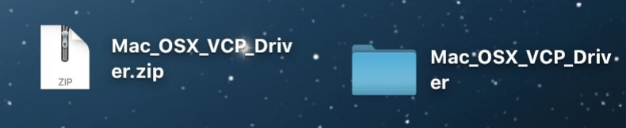
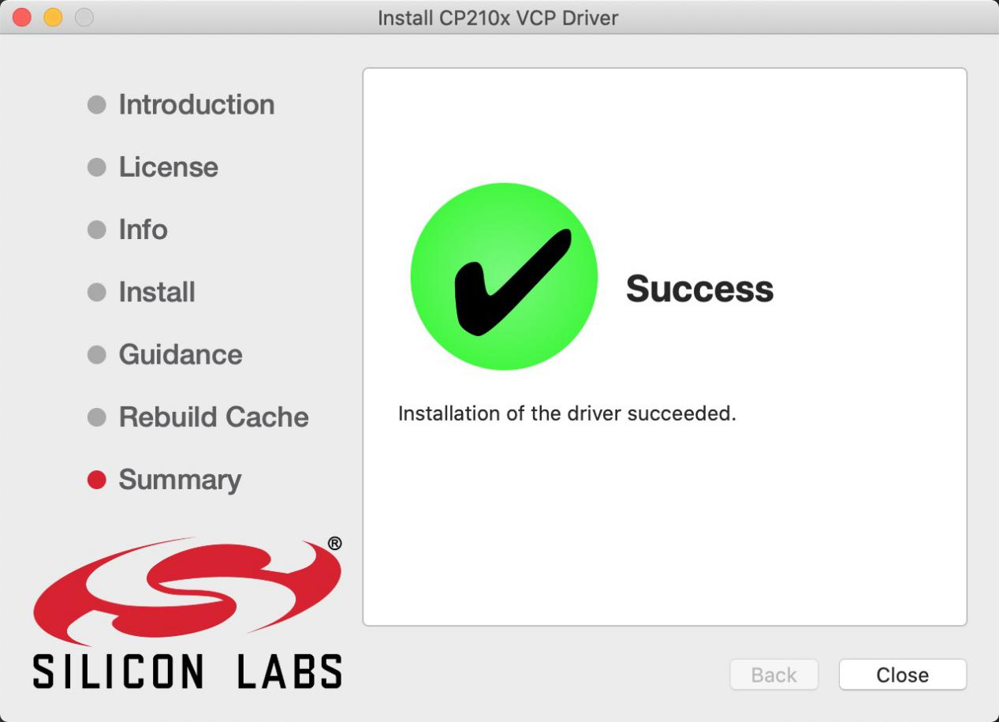

# 5. Treiberinstallation

## 5.1 Windows-System

**Treiberüberprüfung**

1. Verbinden Sie das Motherboard mit dem Computer.

2. Öffnen Sie den Geräte-Manager. Wenn die Meldung **"Silicon Labs CP210x USB to UART Bridge (COMx)"** erscheint, ist der Treiber bereits installiert. Bitte überspringen Sie dann den Abschnitt **"Treiberinstallation"**.

**Manuelle Treiberinstallation**

1. Treiber herunterladen

- Windows-System: [Windows-System-Treiber](./Windows.7z)

2. Verbinden Sie das Motherboard mit dem Computer, öffnen Sie den Geräte-Manager. Wenn vor dem Treiber ein gelbes Ausrufezeichen erscheint, ist der Treiber nicht installiert. Bitte laden Sie den Treiber herunter und installieren Sie ihn manuell.

## 5.2 MAC-System

**1. Treiberüberprüfung**

Verbinden Sie das Entwicklungsboard mit dem Computer. Wählen Sie im Menü [Tools] ---> [Port] den Port des Entwicklungsboards aus (Hinweis: Wenn Sie den Port des Entwicklungsboards nicht sicher identifizieren können, verbinden Sie das Motherboard und machen Sie Fotos aller Ports. Trennen Sie dann das Entwicklungsboard, machen Sie erneut Fotos aller Ports und vergleichen Sie die Bilder, um den verschwundenen Port zu finden. Der verschwundene Port ist der Port des Boards. Wählen Sie diesen Port anschließend aus.) Wenn der Port nicht erkannt wird, wechseln Sie den USB-Anschluss am Computer oder das Kabel und versuchen Sie es erneut. Falls es weiterhin nicht funktioniert, folgen Sie den nächsten Schritten zur Treiberinstallation.

**2. Manuelle Treiberinstallation**

1. Treiber herunterladen

​       Mac-System: [Mac-System-Treiber](./Mac.7z)

2. Doppelklicken Sie auf das heruntergeladene Treiber-ZIP-Paket, um es zu entpacken.

3. Klicken Sie anschließend auf **"Next"** und installieren Sie weiter, bis die Installation abgeschlossen ist.

An diesem Punkt sollte der Port durch erneutes Einstecken des Boards erkannt werden.

4. Öffnen Sie dann die Arduino IDE, klicken Sie auf „Tools“, wählen Sie das Board Arduino Uno und den erkannten Entwicklungsboard-Port aus.

5. Klicken Sie , um den Code hochzuladen. Es erscheint die Meldung „Done uploading“.

